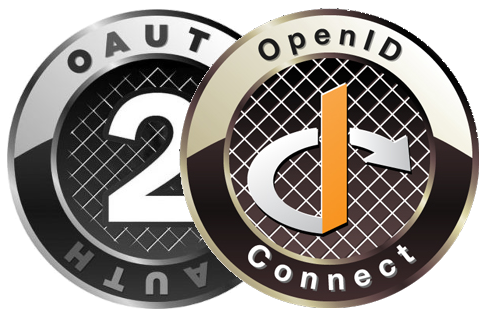

# Integrating Unikname Connect with any Auth2.0 or OpenID Connect solution

!!!include(.vuepress/md-templates/unc-registering-process-what-is-unc.md)!!!

## About OAuth2.0 or OpenID Connect solution

<uniknameconnect/> can be easily integrated within opensource frameworks compatible with the standard OAuth authorization protocol.

In this example, [our discussion forum website](https://forum.unikname.com/) is based on the famous open source [Discourse solution)[https://www.discourse.org]. <unikname/> users are automaticaly signed-in for an optimal user experience.

👉 [Run this example](https://forum.unikname.com/)

**Table of Content**

[[TOC]]

!!!include(.vuepress/md-templates/unc-registering-process-start.partial.md)!!!

## Features

The current implementation of Unikname Connect provides support for:

- Authorization Code Flow
- Implicit Flow
- Standard OAuth2.0 and OIDC endpoints

## Setup

| Attribut | Description |
|--------|-----------|
| OIDC discovery document | <UncServerUrl/> |
| OIDC client id | The client id you have received from Unikname's support request |
| OIDC client secret | The client secret you have received from Unikname's support request |
| OIDC authorize scopes |`openid` by default. But you request for more, such as `profile` or `email` (which may be verified or not) |

### Detailed OAuth 2.0 / OIDC Endpoints

|  Endpoint |                  URL                 |
|:---------:|:------------------------------------:|
| Authorize | `https://connect.unikname.com/oidc/authorize` |
| Token     | `https://connect.unikname.com/oidc/accessToken`    |
| Userinfo  | `https://connect.unikname.com/oidc/profile`    |

!!!include(.vuepress/md-templates/unc-registering-process-end.partial.md)!!!
